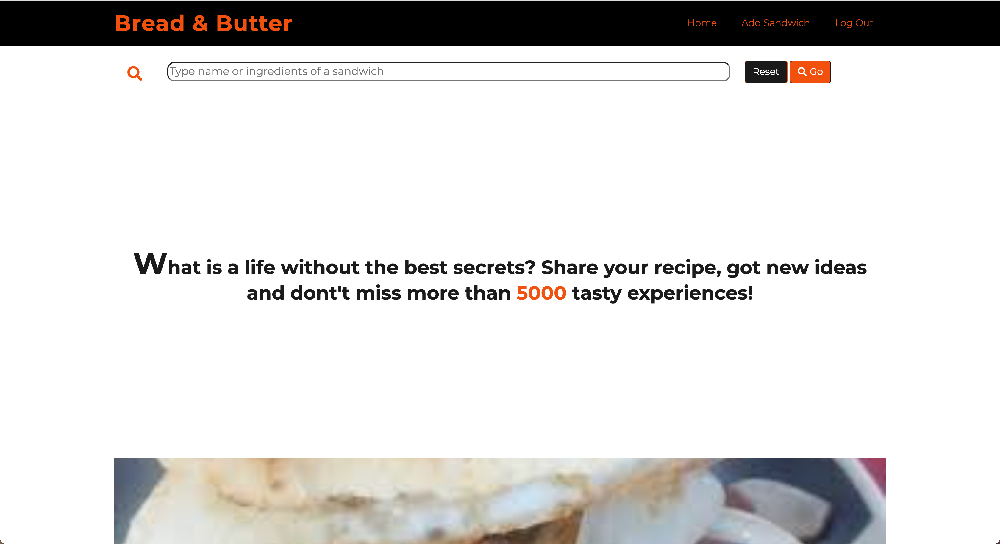
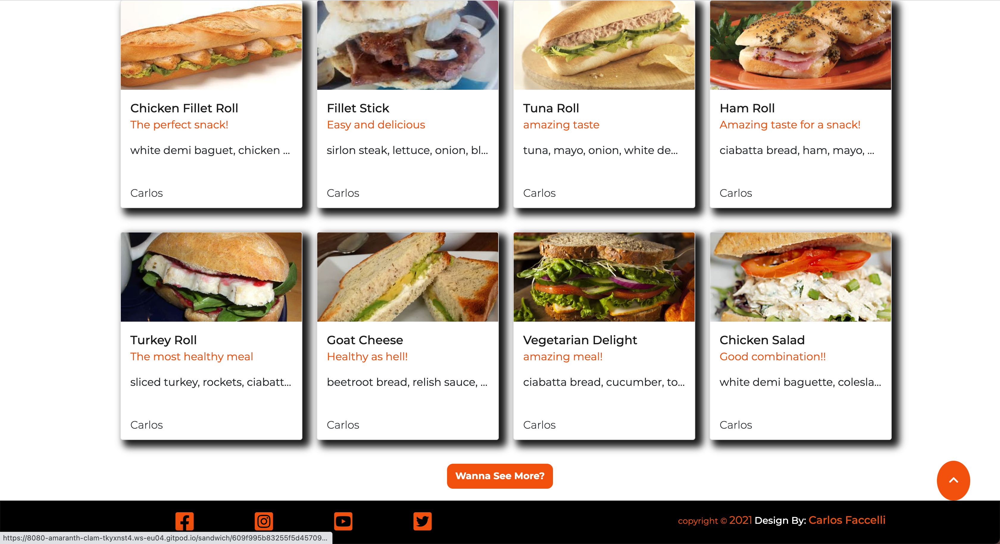

# Bread And Butter **Milestone Project**

You will be able to enjoy the live project following the next [link](https://bread-and-butter-milestone.herokuapp.com/)
Bread and Butter is a project where you will have the function to create, update, delete, and read. [CRUD](https://en.wikipedia.org/wiki/Create,_read,_update_and_delete) functionality.
The idea was born through my own experience. All the project is completly based in my currently employ, I'm working in a Spar as a deli assistant. What I have to do daily, it is to prepare not only sandwiches but also other stuff as salads or breakfasts for de costumers. Because of that my knoledge about sandwiches and different combinations of ingredients is quite extense. Along this project I really want to show what I do for leaving, from a different point of view; from a website being completly focus in the topic. 

# User Experience
## User Stories
  * **As a User of the website**
    - I want to have an easily navigaton.
    - I want to be able to share my recipes with other users. However will be quite important to have the posibility to delete or edit my own recipes.
    - I want to have the posibility of enjoying the shared recipes by other users. 
    - I would like to be able to log in and log out just with one click. 

  * **As a First costumer**
    - I would like to register my account as a new user easily withouth any trouble. 
    - It will be a good option, to have the posibility to preview some sandwiches and how the website will be working in the future If I decide to register an account.
    - It will be mandatory to have an actractive main page.  

  * **As a Owner**
    - Be in charge to always have an eye catching website.
    - Be able to help with any issue the user could find. 

# Design
  * **Color Scheme**
    - The main colours being used along the website design are white, black, and orange.
    - Font used: Montserrat from fontawesome
    - Desktop wireframe:
      - [Desktop](static/images/balsamiq/desktop_view_project.pdf)
    - Mobile:
      - [Mobile](static/images/balsamiq/mobile_view.pdf)

# Technologies and Libraries
  - **Technologies Used**
    1. [HTML](https://en.wikipedia.org/wiki/HTML)
        - Used to create the whole content of the website.
    2. [CSS](https://en.wikipedia.org/wiki/CSS)
        - Used to create an eye catching website whith an attractive design.
    3. [JavaScript](https://en.wikipedia.org/wiki/JavaScript)
        - Used to make the website interactive.
    4. [Python](https://en.wikipedia.org/wiki/Python_%28programming_language%29)
       - Used to handle the backend of the webiste.
    5. [MongoDb](https://www.mongodb.com/1)
       - Database to store information about users and sandwiches which have been added.
  - **Libraries Used**
    1. [Boostrap](https://getbootstrap.com/)
        - Used to create a nice and a clear layout.
    2. [Font Awesome](https://fontawesome.com/)
        - Used to create an attractive typography.
    3. [Flask](https://flask.palletsprojects.com/en/2.0.x/)
        - Framework that works with python. All the project is based on Flask.
    4. [Flask Login](https://flask-login.readthedocs.io/en/latest/)
        - Dependency of Flask. Used to handle log in and log out functionality.
    4. [Heroku](https://www.heroku.com/)
        - Platform used to deploy the project.
    5. [Git](https://git-scm.com/)
        - Used to version control of the project.
    6. [GitHub](https://github.com/)
        - Used to store the project.
    7. [Balsamiq](https://balsamiq.com/)
       - Used to create the mockup which will be the base of the live project.
    8. [Flask WTF](https://flask-wtf.readthedocs.io/en/stable/)
       - Used to create forms on python and rendering on the templates.
    9. [Am i Responsive](http://ami.responsivedesign.is/#)
       - Used to create a mockup to add on readme.md file.

# Features
  1. This project is completly responsive on all devices.
  2. We will be describing the project section by section.

# Testing
Bread and Butter project has been tested on validators online such as:
  - [HTML Validator](https://validator.w3.org/)
    - 
    - 
    - 
    - 
    - 
    - 
  - [CSS Validator](http://jigsaw.w3.org/css-validator/)
    - 
  - [Javascript Validator](https://jshint.com/)
    - 
  - [PEP8](http://pep8online.com/)
    - 

# Testing UX Stories
1. As a user of the website:
     **I want to have an easily navigaton**
    The Website has been designed thinking since the very first moment about the user experience, because of that you will find an easy navigation. Each button will have a descriptive text that will give to the user the facility to understand what will be happening after clicking on the button. The Bread and Butter Website does not have any unnecessary complexity to navigate as we are looking for the confort of the users avoiding the frustration feelings. 

   - **I want to be able to share my recipes, deleted them or edited If I need**
    - As we mentioned before, all the project is  handled by [CRUD](https://en.wikipedia.org/wiki/Create,_read,_update_and_delete) functionality where will find the different options: *Create*, *Read*, *Update*, and *Delete*. Neverthelss is mandatory for the user to log in If they want to be able to manage some these functionalities. 
        - **Create**: This function will give you the posibility to add some info into the website. For example in the case of Bread and Butter, you will be able to add a sandwich. The user will give all the information about the sandwich throught  the form, which has different fields to fill following the goal of sharing the key information about the sandwich, such name, brief description, ingredients, or image, with the other users. As soon as all the fields are done, If there is nothing wrong, the sandwich will be added to the website straigh away being visible on the main page (If there are no more than 8 sandwiches) or in a section called All sandwiches.
        - **Read**: This function give you the ability to read the content storage on the database at the same time you will be able to displayed on the website nicely. 
        On this website all users, logged in or not. will be available to see a few sandwiches to have a preview of the website functionality. If they want to see all the recipes shared, they will need to register or log in If they already have an account.
        Users can see each sandwiches if they want. But only if they are logged in.
        - **Update**: Update will give you the ability to change any information about the sandwich created by the user. Users won't be able to change details of any sandwich created by a different user, they will have the posibility to change the info of their own creations. If they decided to edit their recipes they just will need to rewrite the fields of the form mentioned before, that they want to modify.
        - **Delete**: Delete like the word says, gives the user the capacity to delete a sandwich. As we mentioned before, the user will be able just to delete their own creation. 

   - **I want to enjoy the recipes of other users**
       Once you have an account and you are in, you will be able to see all the sandwiches recipes. However won't be possible to modify the creations added by other users. 

   - **I would like to be able to log in and log out just with one click**
     - The website provides a very easy process to log in and log out. Once your account is registered in the system, you will just need to enter your usser name and your password to Log in. You will be able to Log out just clicking on the proper botton.

   
2. As a firts customer
   - **I would like to register my account without any trouble**
      If you want to register your account as a new user, you will just need to complete all the fields of a form. Once the user complete the registration form, If there are not mistakes, the website will display an alert with the following message: "**Registration successfully. You are able to login.**". 
      You will be ready to enjoy Bread and Butter adding sandwiches or just catching some ideas for your next dinner. 

   - **Be able to have a preview of the website**
       Since the first moment you start surfing the website you will find different texts where you have some hints about what you can find or what you can do in Bread and Butter. Because of that the first customer will Know since that moment If this website could fit his interests. However the main page would be attractive enought to catch his attention. 

   - **I would like to find an attractive main page**
      You will see how it is not mandatory to Log in just to navigate through the main page, so the first user who is thinking to register an account will have the posibility to have a brief view and understanding of how the website will works. To make the main page quite attractive the same patron of colours have been followed. At the same time the first user will be able to enjoy the carousel, where a maximun of 8 sandwiches will be displayed. The bottons on the main page have the posibility to change deppending of the amount of sandwiches have been added to the website. If there are not 8 yet, the text the first user will see is the next one: "*wanna add a sandwich?*". Nevertheless If there are more than 8 sandwiches already in the website you will find the following text:"*Wanna See More?*". Thanks to they way this questions have been popped the main page is not only attractivebut also interactive with the First user. 

3. As a owner
   - **Have a eye catching website**
      The project has been designed thinking in every single detail because of that you can find a nice contrast of colours between black, orange and white. Bread and Butter not only is working so goo but also has a nice looking catching the attention of the user. At the same time to do not make the user feel bored, there are some animations to avoid a static website. 

   - **Be able to help with any issue**
      As you will be able to see once yoou get into the website, all the social media are located in the footer. Thanks to this conection the user will be able to get in touch with the owner of the website through Instagram, Facebook or Twiter. 

# Testing Project
  - All project has been tested manually for me and friends which I share the link of the website.
1. Main Page:
   - First thing to notice is that links on the navbar will change depends if the user is logged in or not as I show in the next pictures
   
   In this picture we can see we have three links, home link will never change since can been seing for any user log in or log out. In this case user is not login on the website wich means the two remining links will be for register in case that the user is not register or log in in case that the user is already register.
   
   As we can see, we have differents links on the navbar. As i worte before home link won't change. The new two links are add sandwich which will lead the user to a form to add a sandwich, and log out link, which will close the session.
   
   Scrolling down the main page we find a carousel which will display up until 3 sandwiches added by randome users. In the picture we can see two sandwiches due there is only two sandwiches added at that moment.
   Each sandwich card will be a link that if the user clicks will lead to the description of that particular sandwich.
   Last but not least we have a button, wich will change if there is more than 8 sandwiches. Currently the button will lead the user to a form to add a new sandwich.
   
   As we can see now we have more than 8 sandwiches so the button will change to the text of **wanna see more**. This button will lead the user to the page where all the sandwiches are stored.
2. Login Page:
   - 
   
   As we can see the Login page will consist in a simple form with a backgorund of black and white, playing with the color of text to give a nice contrast.
   
   If user type the correct credentials will be redirect to the main page with a message letting know the user that he was successfully logged in.
   
   If user use a credentials that doesn't exist or just an typing error the form won't be submitted and the user will be redirect to the login page with a massage describing that username or password are incorrect and he must try again.
3. Register Page:
   - 
   
   Register page wil be basicly the same layout than login page, same contrast between black orange and white.
   
   If user doesn't accomplish the pattern of the input field, the form when submitted will give an error displaying the error in a message with a red text. Same if the user try to register with a email already in use in the database, it is not possible to register with an email already registered.
   
   If password doesn't match the form won't be submitted and the user won't be register. Password must match to user be able to register on the webiste.
   
   Once the user has filled all the inputs and inputs are correct and no errors are showed the user will be successfully registered. User will be redirect to the login page with a message describing that registration was a success.
4. Adding sandwich:
   - 
   
   Add sandwich page will consist in a form with pretty much the same layout than register and login page. The only different will be that the form will have more fields to fill up.
   
   
   
   
   
   
   
   All these images test how each input will behave if the input has not been filled. All field must be filled to submit the form and the sandwich will be added.
   
   If all the fields are filled and show no errors the form will redirect the user to the main page and show a message wich contain the text describing that the sandwich has been added.
5. Edit Sandwich:
   - 
   
   Edit sandwich template will have a form same layout of add sandwich template. With the diffrerence of all the fills will be populated with the data that was used to add the sandwich, so the user won't waste time filling up all the fields again and then submit the form.
   
   Once the user has updated the sandwich the form will redirect the user to the sandwich tempalte with a message with a text describing the action that the user has realized.
6. Individual Sandwich:
   - 
   Sandwich template will display a single sandwich with all the details of the sandwich. In these case the sandwich was created by the same user. This is because there is two buttons which give two different actions. One is to update the sandwich the other to delete it. Only to the user that has created the sandwich will appear the two buttons.
   
   As we can see in the page the two buttons doesn't appear, that is because the user didn't create the sandwich, for these reason user can't edit or delete the sandwich. If user type the route to edit or delete the sandwich the page will show an error [403](https://en.wikipedia.org/wiki/HTTP_403) customize. Next will be attached the screenshot will describe these error.
   
   As we can see if the user try to delete or update a sandwich that the user hasn't created the page will show the error with a link to go back to the main page.
7. Search From:
   - 
   Search form is located on the main page at the bottom of the page, below the navbar. If user doesn't fill the input the form won't be submitted.
   
   If user filled the form and submit it but the webiste doent't find the sandwich that the user is looking for the page will show a massage describing the there is no results for that search.
   
   If user fill the input and the website has the sandwich that the user is looking for the website will display the sandwich bellow the carousel on the main page.
8. Delete Sandwich:
   - 
   If user wants to delete the sandwich, if the user was the creator of the sandwich will be able to see two buttons, one for update and the other to delete. If user clicks on delete button a modal will popup with two buttons and a text asking the user if the user is sure about deleting the sandwich. The buttons will have the actions of delete the sandwich or close the modal.
   
   If the user deletes the sandwich user will be redirect to the main page with a flash message describing the action the the user has just make.
9. Limiting Acces:
   - 
   If user is not currently logged in and try to access any page or functionality that require to be logged in, the user will be redirect to the login page with a message asking the user to login to gain access to the page.
10. All sandwiches:
   - 
   
   As we can see all sandwiches template will consist in display all sandwiches. The leyout will be two columns. Max quantity of sandwiches per page was set to 10 sandwiches in case that there is more than 10 sandwiches we'll have links for pagination which allow the user to keep seeing more sandwiches. Each card title will be a link to see that specific sandwich.
   
   Here we see the pagination which lead us to the second page where we find one sandwich due in the previous page were displayed 10 sandwiches.

# Deployment
Project was stored on [GitHub](https://github.com/) and deployed on [Heroku](https://www.heroku.com/). This change due the previous milestone project is due [GitHub](https://github.com/) does not support backend code however [Heroku](https://www.heroku.com/) it allows to deploy code base on backend.
First of all I created a repo on [GitHub](https://github.com/) as i show in the next picture.

After this step we should add information about the repository for example name, template etc..

Once the repo is created we create a new app on [Heroku](https://www.heroku.com/):

After we created the app, we must choose the region that we are currently living in and the name of the app:

After we create the app give a name and provide the region that we are currently in we'll find a dashboard in which the first step is to connect the app with the repo on [GitHub](https://github.com/)(To allow this step to work heroku will need some specific files Procfile and requirements.txt wich were created on python file):

We must be sure that the name that we include to connect the github repo match with name of the repo on github otherwise it won't find any repo with the name provided:

Once we connect the github repo with heroku we can click on settings.

After clicking on settings we scroll down until we find a button, if we click on that button it will reveal some variables that we need to fill up with the variables that we provide in the code of the project for example: Secret Key for flask, name of the database, the URI etc....

**Cloning repository**
* *Cloning from github*
    - First of all we log in in [GitHub](https://github.com/) and find the repo that we want to clone in this case will be [Bread and butter](https://github.com/CarlosFaccelli26/Bread-Butter-Milestone), chose the option of code and then open with github as I show the next picture
      
    - After click on that button a window will pop up asking us if we want to open with github desktop_view_project
      
      Once this step is done a new window will open with a few options
      
    - Finally the project will be clone in our desktop
      
    - Once we have cloned the project we need to install all the requirements that the project is based on to do this we need to type in the terminal: **pip3 install requirements.txt** and all the dependencies used on the project will be installed.

# Credits
  1. Flask Login, Flask Wtf, Modal [Corey Schafer]()
  2. Flask Paginate [Darilli Games](https://github.com/DarilliGames/flaskpaginate/blob/master/app.py)
  3. Back to top button [W3S School](https://www.w3schools.com/howto/)
  4. Animations [CSS Tricks](https://www.html-code-generator.com/css/animation-generator)
  5. Thanks to my mentor [Rahul](https://codeinstitute.net/)
  6. [Stack Overflow](https://stackoverflow.com/), underline with effect on navbar 
  8. Card animation on index.html [Hover Effect](https://codepen.io/nxworld/pen/ZYNOBZ)
  9. [favicon](https://favicon.io/)
  